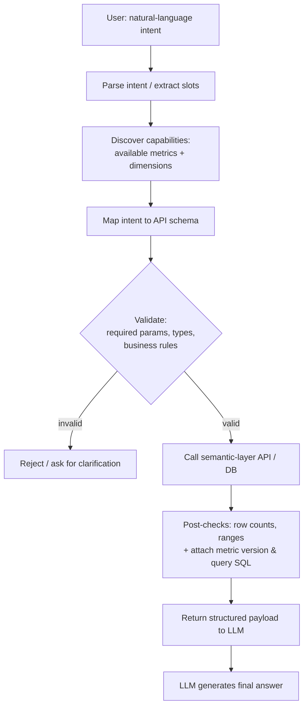
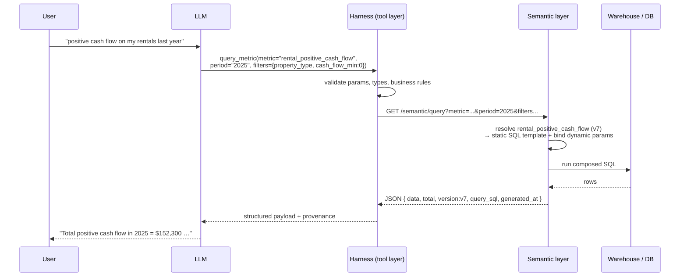

# Building a Semantic Layer for LLMs: A Field Guide to the Five Types

*By Vishal Mysore*

---

If you've spent any time wiring a Large Language Model up to a real database, you already know the failure mode. The model joins the wrong tables, invents column names, and confidently reports a "revenue" number that has nothing to do with how your finance team actually defines revenue. The schema is technically correct, and the answer is technically wrong.

Here's the mismatch in one line. You ask for *"active users last month"* and the model emits `SELECT COUNT(*) FROM users WHERE last_login > '2026-05-01'` — but your product's real definition of an active user is *three or more sessions in a rolling 28-day window*, computed from an events table the model never even touched. The query runs, returns a tidy number, and is silently wrong.

The fix is not a bigger model or a cleverer prompt. The fix is a **semantic layer**.

A semantic layer gives the LLM standardized business metrics, logic, and context. It acts as a translation system that sits between raw tables and the model, guiding the AI to interact with data exactly the way the business defines it. Instead of letting the model guess what "active customer" or "net margin" means, you encode those definitions once and force every query through them. Hallucinations and schema-based errors drop because the model is no longer reasoning from scratch — it's reasoning from your business's shared vocabulary.

A crucial distinction, though: a glossary written in English — a wiki page that says *"active user means three sessions in 28 days"* — helps humans, not models at runtime. What a production LLM needs is that same definition expressed as **machine-enforceable metadata and rules**: typed metrics, parameterized SQL, dimensions, and filters the system applies whether or not the model remembers to. English documents the intent; metadata enforces it.

But "semantic layer" is not one thing. There are several distinct types, and they differ mainly by **where they live in the data stack**. Choosing the right one depends on your warehouse, your tooling, and how much you care about portability versus simplicity. Here are the five.

---

## 1. Universal (Cross-Platform) Semantic Layers

These are standalone, vendor-agnostic middleware platforms. They sit between your data warehouse and *all* of your downstream consumers — AI agents, BI dashboards, notebooks, internal apps. The layer processes natural language, maps the concepts it finds to your data models, and pushes the resulting query down to the database for execution.

The defining trait is **centralization without lock-in**. Your KPI definitions live in one place and are served identically to every tool that asks, regardless of which database sits underneath.

**Best for:** Multi-tool environments where you want consistent, centralized business logic across many consumers and refuse to be tied to a single vendor's ecosystem.

---

## 2. Built-in (BI-Native) Semantic Layers

These semantic models are tightly integrated inside a single Business Intelligence platform. The metrics, dimensions, and relationships are defined within the BI tool itself, and they shine when you query data through that same vendor's conversational AI assistant.

The trade-off is convenience for portability: the logic is excellent inside its home ecosystem and largely invisible outside it.

**Best for:** Teams that operate primarily within a single BI or data-visualization ecosystem and want their LLM assistant to inherit definitions that already power their dashboards.

---

## 3. Transformation Layer-Embedded Semantic Layers

These define metrics, dimensions, and semantics **as code** — typically YAML — sitting right alongside the raw SQL transformations that build your tables. Business definitions become a first-class part of the data pipeline rather than a separate artifact bolted on afterward.

Because everything is code, everything is version-controlled. Definitions are reviewed in pull requests, diffed over time, and flow seamlessly from the transformation step into query engines and LLMs.

**Best for:** Data teams that want git-native, version-controlled modeling, where a change to a metric definition is a tracked, reviewable event just like any other code change.

---

## 4. Database-Native Semantic Layers

Instead of standing up a separate tool, these semantic layers are built directly into the cloud database or data platform itself. The platform translates and executes user intent natively, leaning on its own query optimizer and built-in AI/LLM integrations.

The big win is architectural simplicity. There is no external service to operate and no data movement between systems — the semantics, the optimizer, and the model integration all live in one place.

**Best for:** Streamlined architectures that want to eliminate external services and keep the entire path — from intent to execution — inside a single platform.

---

## 5. Knowledge Graph & Active Semantic Layers

Unlike the tabular layers above, these use graph databases to capture complex relationships and entity definitions. Rather than just mapping a phrase to a column, they provide a reasoning engine — a knowledge graph — that excels at multi-hop and deeply contextual questions where the answer depends on chains of relationships.

Their other strength is reach: they are well suited to connecting unstructured sources (documents, tickets, chat logs) with structured enterprise definitions, so an agent can reason across both worlds at once.

**Best for:** Advanced AI agents that need to answer multi-hop questions and bridge unstructured content with structured business definitions.

---

## How LLMs Actually Call a Semantic Layer

A semantic layer exposed only as English descriptions is valuable for humans but insufficient for production LLM access. You need structured metadata, an API contract, and a runtime bridge so that the model's intent becomes a *deterministic* query against governed definitions. An API is necessary but not sufficient — you also need a deterministic bridge that maps language to that API.

In practice that bridge — call it a harness, agent wrapper, or tool layer — translates natural-language intent into validated, parameterized API calls, enforces business filters and row-level security, and returns a deterministic payload the model can safely summarize. Whether you need to build one depends on where your semantic layer lives: BI-native and database-native platforms sometimes include it, while cross-platform or REST-only layers usually require you to supply the wrapper yourself.



### What the harness does (minimal responsibilities)

- **Capabilities discovery** — expose the available metrics, dimensions, and their types so the model knows what it can ask for.
- **Intent-to-call mapping** — convert parsed intent or slot values into the semantic layer's API schema.
- **Validation** — check required params, types, and business rules *before* execution.
- **Execution** — call the semantic-layer API or database, handling timeouts and retries.
- **Post-checks & provenance** — sanity-check the result (row counts, value ranges), attach the metric version and the exact query text, and return structured data for the model to summarize.

### The tool schema the model sees

The model never sees raw SQL. It sees a constrained tool whose enums and required fields make most invalid calls impossible to express:

```json
{
  "name": "query_metric",
  "description": "Query a governed business metric over a time range.",
  "parameters": {
    "metric":     { "type": "string", "enum": ["monthly_active_customers", "net_revenue"] },
    "period":     { "type": "string", "description": "ISO range or named period, e.g. Q1-2026" },
    "dimensions": { "type": "array",  "items": { "type": "string" } },
    "filters":    { "type": "object" }
  },
  "required": ["metric", "period"]
}
```

### An example flow

Intent → structured call → API → deterministic result → natural-language summary:

```text
1. Parse intent:        user → "monthly active customers last quarter"
2. Map to metric:       lookup("monthly_active_customers") → {metric_id, sql_expr, version: 42}
3. Validate params:     ensure date_range present; apply org + row-level filters
4. Call API:            GET /semantic/query?metric=monthly_active_customers&period=Q1-2026
5. Verify + provenance: check row_count > 0; attach metric_version=42, query_sql="SELECT ..."
6. LLM summarizes:      "Monthly active customers (definition v42) = 12,345 for Q1 2026."
```

The number the model reports is computed by the governed definition, not by the model. The model's only job is step 6 — turning a trusted, deterministic payload into prose.

### Integration options (pick one)

- **Use platform-supplied tooling** — many semantic-layer or BI platforms ship SDKs/wrappers that already act as the harness. Lowest engineering cost.
- **Build a lightweight wrapper** — implement the responsibilities above as a small REST/gRPC service that the agent calls as a tool.
- **Embed it in the agent runtime** — if you own the agent, integrate the API client and validation logic directly into its tool-calling layer.
- **Avoid "LLM-only" calling** — never let the model hit raw DB or API endpoints without an orchestrating layer that enforces the semantics.

---

## A Worked Example: "Positive Cash Flow on My Rentals Last Year"

Everything above is easier to see with a real request. Suppose the user types:

> *"Get me all the positive cash flow in my rental properties for last year."*

Here is the crucial thing to internalize: **the semantic layer does not compute cash flow, and neither does the LLM.** The LLM never writes SQL, and you never write SQL by hand. The request is turned into a deterministic, governed call against a *pre-defined, versioned metric* — say `rental_positive_cash_flow` — and the semantic layer generates the SQL from that definition. The whole chain is:

```
User → LLM → Harness → REST API → SQL (generated by the semantic layer) → DB
```



### Step 1 — Parse intent into slots

The LLM (or the harness ahead of it) extracts structured slots from the sentence:

| Slot | Value |
|------|-------|
| Metric | `rental_positive_cash_flow` |
| Filter | `property_type = "rental"` |
| Condition | `cash_flow > 0` (positive only) |
| Time range | "last year" → `2025-01-01` … `2025-12-31` |
| Grouping (optional) | by property, by month |

### Step 2 — The LLM emits a constrained tool call

The model only ever sees a typed tool, not a SQL prompt. The enums and required fields make most invalid calls impossible to express:

```json
{
  "name": "query_metric",
  "parameters": {
    "metric":     { "type": "string", "enum": ["rental_positive_cash_flow", "net_revenue"] },
    "period":     { "type": "string", "description": "ISO range or named period, e.g. 2025" },
    "dimensions": { "type": "array",  "items": { "type": "string" } },
    "filters":    { "type": "object", "properties": {
        "property_type":  { "type": "string" },
        "cash_flow_min":  { "type": "number" }
    }}
  },
  "required": ["metric", "period"]
}
```

…and calls it with concrete arguments:

```json
{
  "metric": "rental_positive_cash_flow",
  "period": "2025",
  "dimensions": ["property_id", "property_name", "month"],
  "filters": { "property_type": "rental", "cash_flow_min": 0 }
}
```

### Step 3 — Harness validates and resolves the governed definition

The harness confirms the metric exists, checks required params and types, applies row-level security, then looks up the **static, versioned** definition the metric points at:

```text
rental_positive_cash_flow
  ├─ metric_id: rental_positive_cash_flow
  ├─ version:   v7
  └─ template (defined once, reviewed, version-controlled):
       SELECT property_id, property_name, month,
              SUM(rental_income)
                - SUM(expenses + maintenance + taxes + insurance) AS cash_flow
       FROM rental_cash_flow_view
       WHERE property_type = :property_type
         AND period >= :period_start
         AND period <  :period_end
       GROUP BY property_id, property_name, month
       HAVING cash_flow > :cash_flow_min
```

The accounting formula — income minus expenses, maintenance, taxes, insurance — is **not** invented per request. It lives in the definition. The request only supplies the *values* that get bound into the `:placeholders`.

### Step 4 — Execute via the semantic API

The harness issues one HTTP call. No SQL crosses the wire from your code:

```text
GET /semantic/query
    ?metric=rental_positive_cash_flow
    &period=2025
    &dimensions=property_id,property_name,month
    &filters.property_type=rental
    &filters.cash_flow_min=0
```

The semantic layer binds the dynamic parameters into the static template and runs the composed query:

```sql
WITH cash AS (
  SELECT property_id, property_name, month,
         SUM(rental_income)
           - SUM(expenses + maintenance + taxes + insurance) AS cash_flow
  FROM rental_cash_flow_view
  WHERE property_type = 'rental'
    AND period >= '2025-01-01'
    AND period <  '2026-01-01'
  GROUP BY property_id, property_name, month
)
SELECT * FROM cash WHERE cash_flow > 0;
```

It returns a structured, provenance-stamped payload:

```json
{
  "metric": "rental_positive_cash_flow",
  "version": "v7",
  "period": "2025",
  "data": [
    { "property_id": "p1", "property_name": "Apt 101", "month": "2025-01", "cash_flow": 1200 },
    { "property_id": "p1", "property_name": "Apt 101", "month": "2025-02", "cash_flow": 1350 }
  ],
  "total": 152300,
  "query_sql": "WITH cash AS ( ... )",
  "generated_at": "2026-06-17T10:41:00Z"
}
```

### Step 5 — The LLM summarizes (and only summarizes)

The model's sole remaining job is to turn a trusted payload into prose:

> *"For 2025, your rental properties had a total positive cash flow of **$152,300**. Below is the breakdown by property and month (only months with positive cash flow shown)."*

The dollar figure was computed by the governed definition, not by the model. If anyone disputes it, the `version: v7` and `query_sql` in the response let you reproduce it exactly.

### Dynamic, but governed — not free-form

A common confusion: *"if the semantic layer generates SQL, isn't that the same risky dynamic generation we were trying to avoid?"* No. The SQL **is** generated dynamically, but dynamically by the semantic layer binding parameters into a fixed template — not free-text generation by the LLM, and not a single hand-frozen query either.

| Static (defined once, versioned, reviewed) | Dynamic (bound per request from validated params) |
|---|---|
| The metric formula (income − expenses − …) | Filter values (`property_type = 'rental'`, `cash_flow > 0`) |
| The SQL template and the views it reads | The time range (`2025-01-01` … `2025-12-31`) |
| The definition's version (`v7`) | The dimensions / grouping (`property_id`, `month`) |

The result is **deterministic**: the same parameters always produce the same SQL and the same answer. That is the whole point — dynamic enough to serve any time range, property, or grouping the user asks for, but governed enough that the *meaning* of "positive cash flow" can never drift between two questions.

### Where the SQL actually gets generated

The chain is identical across the five types; only the box that resolves the metric to SQL moves:

- **Universal:** the harness calls vendor-neutral middleware that resolves `rental_positive_cash_flow` and generates warehouse-specific SQL.
- **BI-native:** the harness calls the BI platform's API by metric name; the BI engine computes the cash flow.
- **Transformation-embedded:** the metric is defined in YAML beside your SQL models; the engine builds the query from that definition.
- **Database-native:** the warehouse itself resolves the metric and executes natively — no external service.
- **Knowledge graph:** the query traverses relationships (Property → RentalEvent → Income/Expense) and computes cash flow over the graph.

In every case the user sees natural language in and natural language out. The raw SQL and the accounting logic stay behind the governed boundary.

---

## Governance: Treat Metric Definitions Like Code

Version your definitions, require PR reviews on changes, and run automated tests — unit tests for the SQL expressions and integration tests over sample inputs with known answers. Record the metric version in every API response so that any downstream answer is auditable: you can always trace a reported number back to the exact definition and query that produced it. When a metric changes, the version bumps, the test suite gates the merge, and the audit trail tells you which answers were generated under which definition.

---

## How to Choose

The five types are not ranked — each is the right answer for a different stack:

| Type | Lives in | Pick it when |
|------|----------|--------------|
| Universal (Cross-Platform) | Standalone middleware | You serve many tools and want no lock-in |
| Built-in (BI-Native) | A single BI platform | You live inside one BI ecosystem |
| Transformation-Embedded | Your data pipeline (as code) | You want git-native, reviewable definitions |
| Database-Native | The warehouse itself | You want to eliminate external services |
| Knowledge Graph & Active | A graph + reasoning engine | You need multi-hop and unstructured context |

The decision usually comes down to two questions: **what data warehouse or platform are you running on, and which BI or visualization tools (if any) does your team already live in?** A team standardized on one BI suite will get the fastest payoff from a BI-native layer; a team spread across many tools is better served by a universal one; a code-first data team will feel most at home embedding definitions in the transformation layer; and a team chasing minimal moving parts will favor whatever ships natively in their warehouse.

Whichever you choose, the underlying principle is the same: stop asking the model to guess what your business means, and start handing it the definitions. That single shift is what turns a brittle demo into a system you can actually trust in production.
