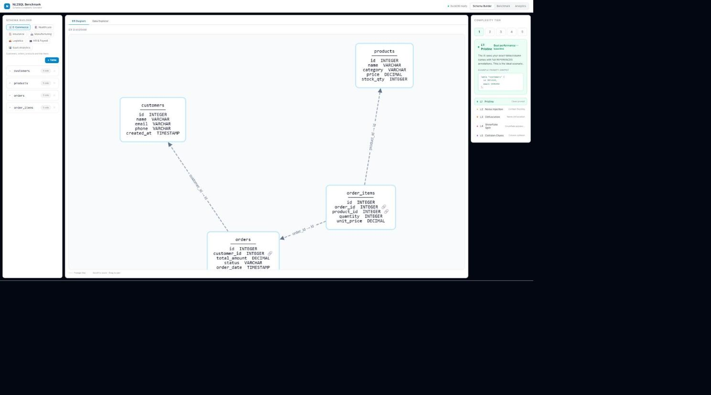
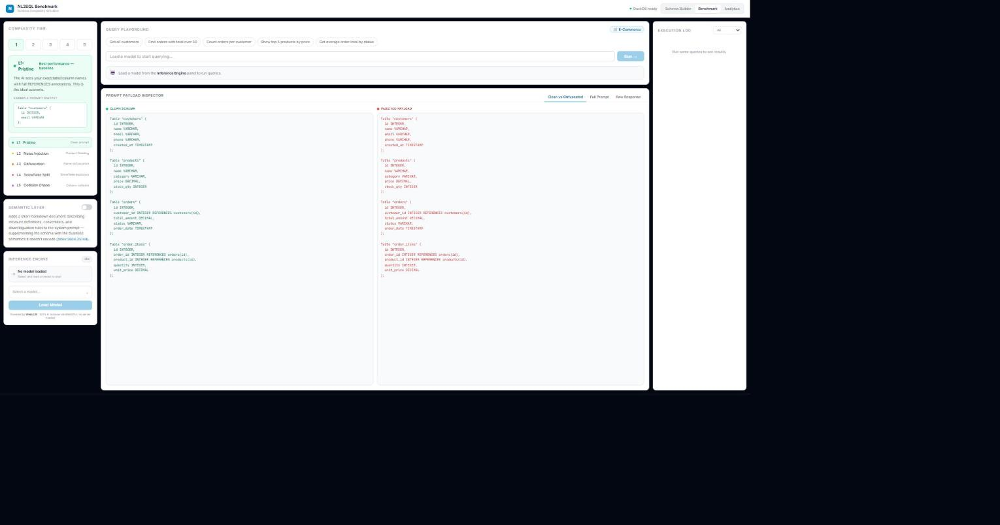
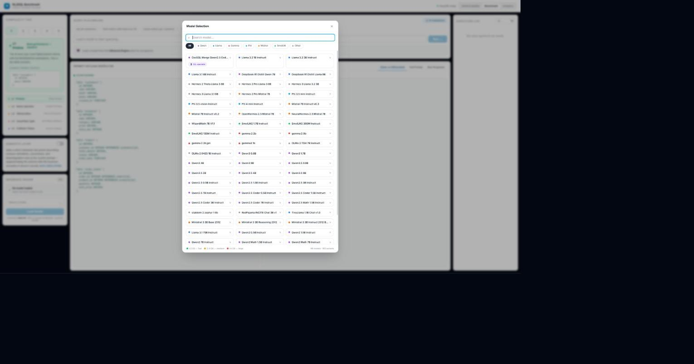
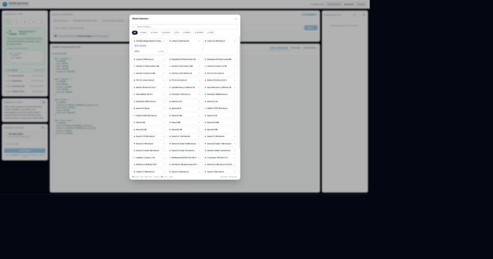
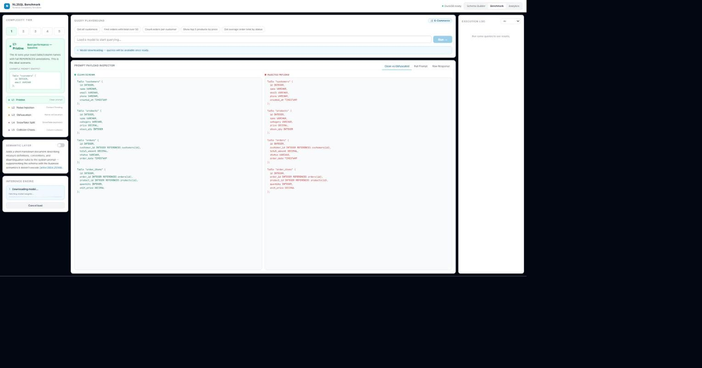
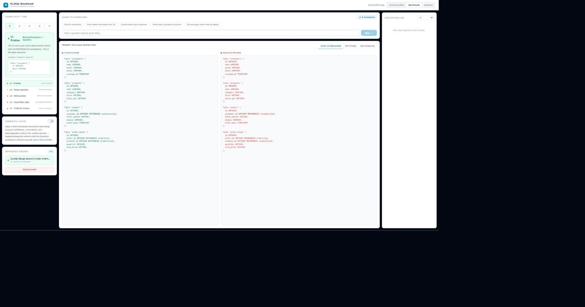
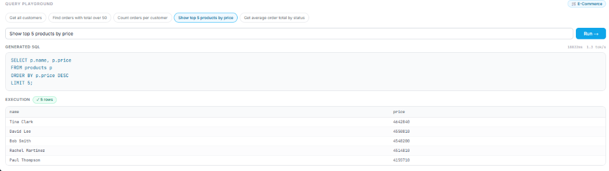

# Running a Real Text-to-SQL Specialist Model in the Browser with WebGPU

## How I added a fine-tuned small language model from the SLM-SQL paper to my NL2SQL Benchmark — real weights, real WebGPU inference, no server, no mocking

*By Vishal Mysore*

---

## Why I Went Looking for a SQL-Specialist Model

When I built [NL2SQL Benchmark](https://vishalmysore.github.io/nlToSQLBenchMark/), every model in the picker was a general-purpose chat model — Llama, Qwen, Phi, Mistral, and the rest — repurposed for text-to-SQL through prompting alone. That's the normal way most people use LLMs for SQL generation, and it's a fair baseline. But it left an obvious question sitting there: what happens if the model itself was actually *trained* for this task, instead of just prompted into it?

I went looking for recent research on small text-to-SQL models — small specifically, because my whole benchmark exists to run entirely client-side on WebGPU, and that only works if the model fits comfortably in a browser tab's GPU memory. That search led me to a paper published in July 2025:

> Lei Sheng & Shuai-Shuai Xu, **"SLM-SQL: An Exploration of Small Language Models for Text-to-SQL"**, [arXiv:2507.22478](https://arxiv.org/abs/2507.22478). [Code & released checkpoints](https://github.com/CycloneBoy/slm_sql).

The paper's whole premise lines up with what I was trying to prove with the complexity-tier benchmark in the first place: model *specialization*, not just model *size*, matters for text-to-SQL accuracy. The authors released real fine-tuned checkpoints on Hugging Face, built on top of Qwen2.5-Coder at 0.5B and 1.5B parameters — exactly the size class that's actually usable in a browser.

So I decided to add one of those checkpoints to the model picker as a real, selectable option — not a mockup, not a "coming soon" badge, an actual model you can load and run.

---

## What the Paper Actually Says

Here's the honest summary, not just the citation. **SLM-SQL** starts from a specific, narrow observation: small language models (0.5B–1.5B parameters) are dramatically worse at text-to-SQL than large ones, mostly because they lack the multi-step logical reasoning that SQL generation over a real schema requires. But small models have a real practical edge — they're fast and cheap enough for edge and on-device deployment, which is exactly the constraint my benchmark runs under. So the paper asks: how much of that accuracy gap can be closed through training alone, without just using a bigger model?

Their method has three parts:

1. **Purpose-built training data.** They derived two datasets from the open-source SynSQL-2.5M corpus: `SynSQL-Think-916K` for SQL generation (with reasoning traces), and `SynSQL-Merge-Think-310K` for a second "merge revision" stage — training the model to review and correct multiple candidate SQL outputs into one better answer.
2. **Supervised fine-tuning, then reinforcement learning.** They start with SFT on the reasoning-annotated data, then apply RL-based post-training (GRPO) on top, which is what actually pushes the accuracy up rather than just teaching the SQL syntax.
3. **Corrective self-consistency at inference time.** Rather than trusting a single generation, the model samples multiple candidate SQL queries and uses the merge-revision training to pick or synthesize a better final answer — this is where the "Csc" (Corrective Self-Consistency) in the checkpoint name `CscSQL-Merge` comes from, borrowing the technique from the same authors' related [CSC-SQL](https://github.com/CycloneBoy/slm_sql) work.

**Reported results**, evaluated on the BIRD development benchmark (a standard, difficult text-to-SQL dataset): across five small models from 0.5B to 1.5B parameters, this training pipeline lifts execution accuracy by an average of **+31.4 percentage points** over the untrained baseline. Their smallest model — the same 0.5B scale as the checkpoint I'm running — reaches **56.87%** execution accuracy on BIRD dev; their 1.5B model reaches **67.08%** on dev and **70.49%** on the held-out test set. I'm reporting these as the paper's own claimed numbers — I haven't independently re-run the BIRD benchmark myself, so I can't personally vouch for reproducing them, but they're what the authors published.

---

## Why This Approach Has an Edge

The case for a specialized small model over a bigger general one, for this specific use case, comes down to three things:

- **Specialization beats brute-force scale, for a narrow task.** A +31.4 point average jump from training alone is a bigger swing than you'd typically get from just moving up a model-size tier. That's the same thesis my own complexity-tier benchmark is built around, from the other direction — I show that *schema* quality changes accuracy more than model size does; SLM-SQL shows that *task-specific training* changes accuracy more than model size does. Both point at the same conclusion: for text-to-SQL specifically, raw parameter count isn't the lever that matters most.
- **It's the only realistic option for browser-based inference.** WebGPU inference lives inside a browser tab's GPU memory budget. A 70B general model is simply not on the table here, no matter how good it is — so the real comparison isn't "small specialist vs. giant generalist," it's "small specialist vs. small generalist," and that's the comparison this paper is actually about.
- **No server, no API cost, no data leaving the browser.** Because the whole point of NL2SQL Benchmark is running 100% client-side, a model that's *both* small enough to fit in-browser *and* specifically trained for the task is the only way to get both privacy/cost benefits and competitive accuracy at the same time.

---

## What I Actually Did — And Didn't Do

I want to be precise about this, because it matters: **I did not train or fine-tune this model.** The machine learning work — the datasets, the SFT, the RL post-training, the corrective self-consistency method — is entirely Lei Sheng and Shuai-Shuai Xu's, published in the SLM-SQL paper and released as real, open checkpoints. None of that is mine to claim.

What I actually did is integration engineering on top of their published work:

1. **Downloaded their real, released checkpoint** — `cycloneboy/CscSQL-Merge-Qwen2.5-Coder-0.5B-Instruct` — exactly as they published it, no modification to the weights or architecture.
2. **Converted it to run in a browser.** Their checkpoint ships in standard Hugging Face format, meant for server-side inference (PyTorch/Transformers). WebGPU-in-browser inference needs a different runtime format entirely — MLC's compiled representation — so I ran it through `mlc_llm convert_weight`, working around the TVM compiler bug described below along the way. This is a compiler/tooling problem, not a machine-learning one.
3. **Hosted the converted weights publicly** on my own Hugging Face account, with a full model card documenting exactly what was and wasn't changed.
4. **Wired it into my app's existing model registry and UI** — the same WebLLM engine, Web Worker, and DuckDB execution path every other model in the picker already uses, plus a badge linking back to the paper so nobody mistakes it for something I built from scratch.

So: research and model = the SLM-SQL authors. Getting that real model to actually run, for free, in a stranger's browser tab, with no server involved = the part I did.

---

## The Constraint I Set For Myself: No Mocking, Ever

If you've read my other write-up on this project, you know the whole point of NL2SQL Benchmark is that everything runs as genuine, verifiable inference — no canned responses, no simulated progress bars. That constraint made this a harder job than just editing a dropdown list. There was no shortcut where I could fake a "SQL specialist" badge without either lying about what the app does or shipping something that silently doesn't work.

So doing this properly meant taking the actual released checkpoint — [cycloneboy/CscSQL-Merge-Qwen2.5-Coder-0.5B-Instruct](https://huggingface.co/cycloneboy/CscSQL-Merge-Qwen2.5-Coder-0.5B-Instruct), a full fine-tune of Qwen2.5-Coder-0.5B-Instruct on text-to-SQL data — and converting its real weights into the format [WebLLM](https://webllm.mlc.ai) needs to run a model on WebGPU.

### Reusing an existing shader library

WebLLM doesn't compile a fresh WebGPU shader for every model — it compiles one per *base architecture and quantization scheme*, and reuses it across any fine-tune of that architecture. Since CscSQL-Merge is a full fine-tune of the exact Qwen2.5-Coder-0.5B architecture WebLLM already ships a compiled shader library for, I only needed to convert the *weights*, not build a new WebGPU compile pipeline from scratch. That's what made this tractable without a full emscripten/wasm toolchain.

### The quantization detour I didn't expect

The plan was to convert at `q4f16_1` — 4-bit group-quantization, the scheme most of WebLLM's prebuilt models use, since it gives the smallest download. Instead, `mlc_llm convert_weight --quantization q4f16_1` segfaulted, consistently, deep inside the MLC/TVM compiler's group-quantization kernel. A GDB backtrace traced it into TVM's `IndexDataTypeNormalizer::Rewrite()`, and it matches a confirmed, still-open upstream bug: [mlc-ai/mlc-llm#3283](https://github.com/mlc-ai/mlc-llm/issues/3283).

Rather than fight an unresolved compiler bug, I switched to `q0f16` — a plain fp16 cast with no grouped-quantization kernel involved at all. It converted cleanly on the first try, and it's arguably a better outcome anyway: it's strictly more faithful to the original trained weights than 4-bit would have been. The tradeoff is a larger download — about 1.4 GB instead of the smaller size 4-bit would have produced. I've written up the full, reproducible conversion steps (including the workaround) in [`tools/convert-cscsql-to-mlc.md`](https://github.com/vishalmysore/nlToSQLBenchMark/blob/main/tools/convert-cscsql-to-mlc.md) if you want to reproduce it or convert the 1.5B variant yourself.

The converted weights are hosted publicly on Hugging Face: [VishalMysore/CscSQL-Merge-Qwen2.5-Coder-0.5B-Instruct-q0f16-MLC](https://huggingface.co/VishalMysore/CscSQL-Merge-Qwen2.5-Coder-0.5B-Instruct-q0f16-MLC).

---

## Walking Through It in the App

Here's what it actually looks like end to end, straight from the [live app](https://vishalmysore.github.io/nlToSQLBenchMark/).

### Schema Builder, unchanged

The Schema Builder and ER diagram views work exactly as before — this update is purely about adding an inference option, not touching the schema-complexity engine.



### The Benchmark tab, before a model is loaded

The Prompt Payload Inspector shows the clean vs. obfuscated schema the model will actually receive — this is what feeds into the SQL specialist too, since the complexity tiers apply to every model in the picker equally.



### Finding it in the model picker

Open the model selector and the new option sits right at the top of the grid, tagged with a **🗄️ SQL specialist** badge that links straight to the SLM-SQL paper.



Expand the card and you can see exactly which quantization build you're loading — `q0f16`, 1.4 GB — no hidden variants, no ambiguity about what's about to hit your GPU.



### Loading real weights over the network

Hitting **Load Model** does exactly what it says — it fetches the real `.bin` shards from the Hugging Face repo I converted and uploaded, live, in front of you.



A minute or so later, depending on your connection and GPU, it reports **WebGPU accelerated** and you're ready to query.



### Real inference, real DuckDB execution

I ran a query against the loaded model and let it generate SQL on its own — no scripted output. Here's exactly what came back: the generated SQL, the elapsed time and tokens/sec, and the actual result set from executing that SQL against the in-browser DuckDB instance.



That's a genuine round trip: natural language question → SQL-specialist model inference on your GPU → generated SQL → real execution against real (synthetic demo) data, entirely inside the browser tab, with nothing simulated along the way.

---

## What Changed Under the Hood

Three source files carry this whole feature:

| File | What it does |
|---|---|
| `src/lib/customModels.js` | Registers the CscSQL-Merge model — its Hugging Face URL, quantization, VRAM footprint, and which existing WebGPU shader library it reuses |
| `src/worker.js` | Merges that custom entry into WebLLM's `appConfig` alongside the 100+ prebuilt models, so the loading/generation code path is identical for every model |
| `src/components/ModelSelector.jsx` | Adds the **SQL specialist** badge and links it to the paper, without touching the existing brand-filtering or search logic |

Nothing about the app's architecture changed — the SQL specialist model rides the exact same WebLLM engine, the same Web Worker isolation, and the same DuckDB-WASM execution path as every other model in the picker.

---

## Try It

```bash
git clone https://github.com/vishalmysore/nlToSQLBenchMark.git
cd nlToSQLBenchMark
npm install
npm run dev
```

Or just open the [live demo](https://vishalmysore.github.io/nlToSQLBenchMark/) — Chrome 113+ with a GPU, no install needed. Open the model picker, look for the 🗄️ SQL specialist badge, load it, and run a query yourself against any of the five complexity tiers.

---

## Citation

```bibtex
@article{sheng2025slmsql,
  title   = {SLM-SQL: An Exploration of Small Language Models for Text-to-SQL},
  author  = {Sheng, Lei and Xu, Shuai-Shuai},
  journal = {arXiv preprint arXiv:2507.22478},
  year    = {2025}
}
```

Base checkpoint: [cycloneboy/CscSQL-Merge-Qwen2.5-Coder-0.5B-Instruct](https://huggingface.co/cycloneboy/CscSQL-Merge-Qwen2.5-Coder-0.5B-Instruct) · Converted weights: [VishalMysore/CscSQL-Merge-Qwen2.5-Coder-0.5B-Instruct-q0f16-MLC](https://huggingface.co/VishalMysore/CscSQL-Merge-Qwen2.5-Coder-0.5B-Instruct-q0f16-MLC)

---

## Conclusion

Adding this model was never really about the badge in the picker — it was a test of whether a purpose-built text-to-SQL model behaves differently from a general-purpose model prompted into the same job, and whether I could prove that difference honestly, with real weights and real execution, inside the exact same benchmark harness I built to measure schema-complexity degradation.

It also reinforced something I already believed about this whole project: running everything client-side isn't just a privacy or cost choice, it's what makes this kind of experiment possible to ship in the first place. I could download a paper's real released checkpoint, convert it myself, host it, and have it running against a live SQL engine in a stranger's browser tab within a day — no infrastructure, no API keys, no approval process. That's a genuinely different way of working with research models than most people are used to.

---

*Built with WebLLM, MLC, DuckDB-WASM, React, and Tailwind CSS. Runs entirely in your browser.*
*— Vishal Mysore*
